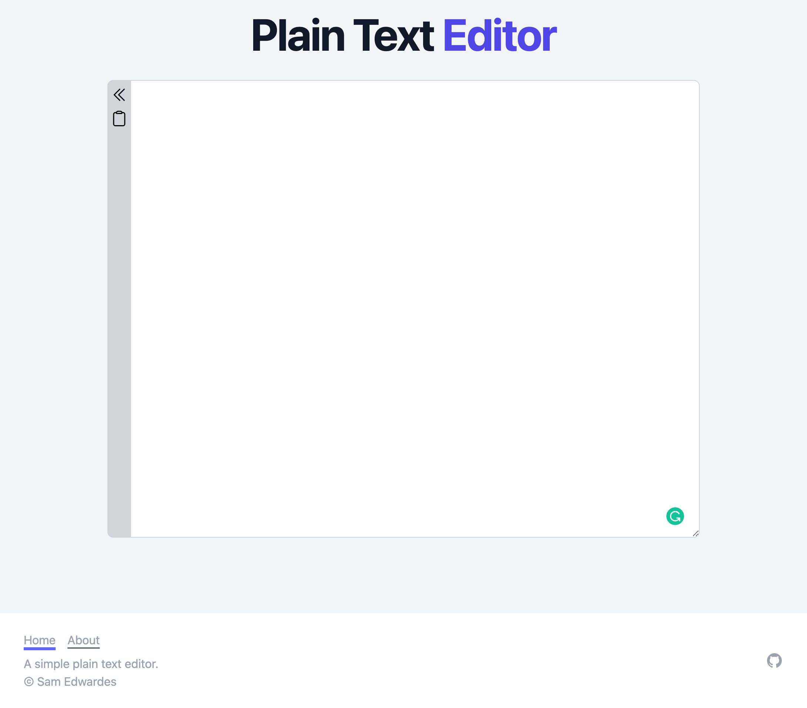

# Plain Text Editor

A very simple web-based plain text editor.

<https://plaintext-editor.netlify.app>



## Setup

Make sure to install the dependencies:

```bash
yarn install
```

## Development Server

Start the development server on http://localhost:3000

```bash
yarn dev
```

## Production

The site is automatically deployed by Netlify on commits to the main branch.
